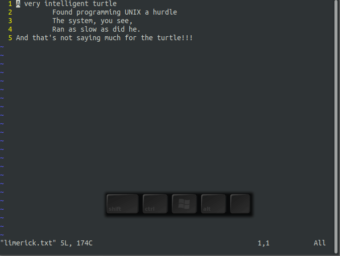

# 编辑快一点

在[基本编辑](chpt01/Chpt01.md)文章中，我介绍了Vim的基本命令，使你能够编辑文本，在这篇文章中，我将介绍一些可以提高编辑效率的命令及技巧。主要包括以下内容：

- 附加移动命令
- 行内快速搜索
- 其它删除和修改命令
- 重复命令
- 宏命令(录制宏和回放宏)
- 连字符

Vim中有很多不同操作方法，本文将讨论众多选择中较为有用的方法。

## 单词移动

- w 前移一个单词，光标停在下一个单词开头；
- b 后移一个单词，光标停在上一个单词开头；
- W 移动到下一个单词开头，但忽略一些标点；
- B 移动到上一个单词开头，但忽略一些标点；
- e 前移一个单词，光标停在下一个单词末尾；
- E 移动到下一个单词末尾，如果词尾有标点，则移动到标点；

就我个人而言，我平时用的最多的就是w和b，也经常会在前面加上数字前缀。例如，2b向后移动两个单词，如图2.1所示：


## 移动到行首或行尾

- $ 将光标移动到行尾;
- 0或HOME键 将光标移动到行首;
- ^ 将光标移动到本行第一个非空白字符处；

上面的3个命令也可以加数字前缀。例如，2$将光标移动到下一行行尾，如图2.2所示：


## 行内搜索

- fs 将光标移动同一行的下一个s字符处
- Fs 将光标移动到同一行上一个s字符处
- ts 把光标移动到同一行下一个s字符处前
- Ts 把光标移动到同一行的上一个s字符后


移动是最常见的编辑操作，其中最有用的就是单字符搜索命令。如fs在本行内向前搜索字符s，Fs在本行内向左搜索字符s,如图2.3所示：


ts命令和fs命令类似，但是它是将光标停在字符s前，将光标停在字符s后的命令是Ts，演示如图2.4所示：


命令;和，常常配合上述命令使用。其中;命令是用于重复上一次搜索，逗号,命令用于反向重复上一次搜索。

## 你在文件中的位置

你怎么知道你处在文件中的什么位置？有很多种方法。其中之一就是用下面的命令打开行号显示:
```
:set number
```

关闭行号显示，用如下命令,如图2.5所示：
```
:set nonumber
```


### 我在哪？

Ctrl-G命令显示一行状态信息，用于说明你当在的位置。比如：

“c2.txt”120L,2642C written 72,10-8    53%

这一行状态信息表示你正在编辑一个名为c2.txt的文件，并且该文件共120行，2642个字符被保存起来了，当前光标所处的位置在第72行，第8个字符，整个文件53%处。

## 移动到指定的行

加入你是个C或C++程序员，例如下面的错误提示，你应该不陌生：

prog.c:3:'j'undelared(first use in this function)

这一行信息告诉你可能需要修改第3行的代码，但是你怎么定位到第3行呢？

也许你可以先9999k回到首行，然后2j跳转到第3行。这不是好办法，但是可行的。

一个更好的办法是使用G命令。3G就可以快速定位到第3行。

单独的一个G会带你到文件的末尾。

## 删除文本

在文章[看完这篇，你就可以用Vim干活了](https://zhuanlan.zhihu.com/p/141955016)里，我介绍了dd命令，它可以删除一整行。dw命令删除一个单词。事实上，d的语法格式是：

```
d motion
```

比如，3w是将光标前移3个单词,d3w命令删除3个单词。如图2.8动画演示：



$命令是将光标移动到行尾。d$删除光标从当前位置（不包含）到行尾的所有字符。如图2.9动画所示：


# 编辑快一点

在[基本编辑](chpt01/Chpt01.md)文章中，我介绍了Vim的基本命令，使你能够编辑文本，在这篇文章中，我将介绍一些可以提高编辑效率的命令及技巧。主要包括以下内容：

- 附加移动命令
- 行内快速搜索
- 其它删除和修改命令
- 重复命令
- 宏命令(录制宏和回放宏)
- 连字符

Vim中有很多不同操作方法，本文将讨论众多选择中较为有用的方法。

## 单词移动

- w 前移一个单词，光标停在下一个单词开头；
- b 后移一个单词，光标停在上一个单词开头；
- W 移动到下一个单词开头，但忽略一些标点；
- B 移动到上一个单词开头，但忽略一些标点；
- e 前移一个单词，光标停在下一个单词末尾；
